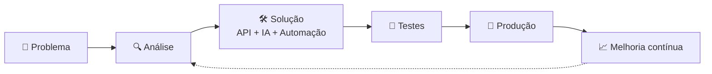

  

---

## 👋 Sobre mim

Olá! Eu sou o **Juan Medeiros**, estudante de Ciência da Computação. Gosto de olhar para uma tarefa repetitiva e pensar: *"isso poderia se resolver sozinho."* Depois disso, eu construo a solução.

| 🤖 Automação | 🧠 Inteligência Artificial | 🔗 Integrações |
|:---:|:---:|:---:|
| Fluxos que fazem o trabalho repetitivo no lugar das pessoas | Agentes de voz e chatbots que conversam de forma natural | Sistemas diferentes trabalhando juntos, sem copiar e colar |

 

  

> ⚡ ***Automatize o repetitivo. Construa o inteligente.***

---

## 🚀 Projetos que desenvolvi

| Projeto | O que faz |
|---|---|
| 🎙️ **Duda — agente de voz de pré-vendas** | Liga para escolas interessadas, conversa de forma natural e agenda a reunião com o time comercial direto na agenda |
| 📞 **Marina — agente de voz de reativação** | Retoma o contato com escolas que esfriaram, conversa com elas e devolve as oportunidades para o time de vendas |
| 💬 **Atendimento com IA no WhatsApp** | Atende famílias e escolas pelo WhatsApp com um agente de IA, responde dúvidas e registra os chamados |
| 🤖 **Tec Zito — assistente de integrações** | Bot no Slack que responde dúvidas do time sobre integrações, buscando as respostas numa base de conhecimento própria |
| ✅ **Criação automática de plataforma** | Quando um negócio é marcado como ganho, a plataforma do cliente é criada sozinha, sem trabalho manual |
| ⭐ **Avaliação de implantação** | Coleta e organiza a avaliação dos clientes após a implantação |
| 🔗 **Automação de parametrização** | Cruza dados de duas bases diferentes para acelerar a configuração das integrações com as escolas |
| 📈 **Relatório de uso de funcionalidades** | Painel que mostra quais módulos e pagamentos os clientes mais usam |
| 🧑‍💼 **Luiza — chatbot de seleção** | Ajuda na atração e triagem de candidatos, conversando pelo WhatsApp e agendando entrevistas |
| 📊 **Painel dos agentes de IA** | Mostra o status e o funcionamento de todos os agentes num só lugar |
| 📦 **Controle de estoque** | Painel web para controlar equipamentos, usando planilha como base de dados |
| 🎂 **Slack Birthday Bot** | Envia mensagens automáticas de aniversário no Slack |
| 🏖️ **Slack Vacation Bot** | Avisa o time sobre férias, lendo os dados de uma planilha |
| 🌐 **Meu site de serviços** | Página de apresentação dos meus serviços de automação de WhatsApp e landing pages para negócios, com simulador do tempo perdido em tarefas repetitivas |

**Código aberto para conferir:**

---

## ⚙️ Como eu construo

**Resultado:** ⚡ mais eficiência • 🔄 menos repetição • 🤖 mais automação

---

## ⚡ Tecnologias

  

---

## 🧠 Estudando agora

- 🗄️ SQL, do zero ao avançado
- 🤖 Agentes e assistentes de IA
- ⚙️ Automação de processos
- 🔗 Integração entre sistemas
- 🧭 Bancos de dados que buscam por significado
- 🌐 JavaScript e desenvolvimento web

---

## 📊 GitHub em números

  

---

## 🌐 Vamos conversar?

  

Feito com curiosidade, automação e muito café. ☕

