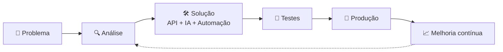

<div align="center">


<br><br>

<a href="https://github.com/Juan640-stake"></a>


</div>

---

# `> whoami`

```text
╔══════════════════════════════════════════════════════════════╗
║                     JUAN MEDEIROS                            ║
╠══════════════════════════════════════════════════════════════╣
║  FUNÇÃO      → Desenvolvedor de Automação & IA               ║
║  EMPRESA     → Bemobi / AgendaEdu                            ║
║  FORMAÇÃO    → Estudante de Ciência da Computação            ║
║  LOCAL       → Brasil 🇧🇷                                     ║
║  FOCO        → Automação | IA | Integrações | Web            ║
║  LEMA        → Aprender → Construir → Automatizar → Melhorar ║
╚══════════════════════════════════════════════════════════════╝
```

## 👋 Sobre mim

Sou estudante de Ciência da Computação e desenvolvedor focado em **automação, inteligência artificial e integração entre sistemas**.

No dia a dia, construo **agentes de voz com IA, chatbots e fluxos automáticos** que tiram tarefas repetitivas do caminho das pessoas, conectando ferramentas como HubSpot, Slack, Zendesk, Google Agenda e sistemas de gestão de escolas.

> *Automatize o repetitivo. Construa o inteligente.*

---

## 🚀 Projetos em destaque

### 💼 Trabalho na AgendaEdu

| Projeto | O que faz | Tecnologias |
|---|---|---|
| 🎙️ **Duda — agente de voz de pré-vendas** | Liga para escolas interessadas, conversa de forma natural e agenda a reunião com o time comercial direto na agenda | ElevenLabs • n8n • HubSpot • Google Agenda |
| 📞 **Marina — agente de voz de reativação** | Retoma o contato com escolas que esfriaram, conversa com elas e devolve as oportunidades para o time de vendas | ElevenLabs • n8n • HubSpot |
| 💬 **Atendimento com IA no WhatsApp** | Atende famílias e escolas pelo WhatsApp com um agente de IA ligado ao Zendesk, respondendo dúvidas e registrando os chamados | n8n • IA (LLM) • Zendesk • WhatsApp |
| 🤖 **Tec Zito — assistente de integrações** | Bot no Slack que responde dúvidas do time sobre integrações, buscando as respostas numa base de conhecimento própria | n8n • Gemini • Supabase (pgvector) • Slack |
| ✅ **Criação automática de plataforma** | Quando um negócio é marcado como ganho no HubSpot, a plataforma do cliente é criada sozinha, sem trabalho manual | n8n • HubSpot • APIs REST |
| ⭐ **Avaliação de implantação** | Fluxo que coleta e organiza a avaliação dos clientes após a implantação | n8n • APIs REST |
| 🔗 **Automação de parametrização** | Cruza dados da base da AgendaEdu com os do sistema de gestão da escola para acelerar a configuração das integrações | SQL • APIs REST • Automação |
| 📈 **Relatório de uso de funcionalidades** | Painel que mostra quais módulos e pagamentos os clientes mais usam | SQL • Metabase |

### 🧪 Projetos pessoais e estudos

| Projeto | O que faz | Tecnologias |
|---|---|---|
| 🧑‍💼 **Luiza — chatbot de seleção** | Chatbot que ajuda na atração e triagem de candidatos, ligado à Gupy, ao WhatsApp e à Google Agenda | n8n • IA (LLM) • Gupy • Google Agenda |
| 📊 **Painel dos agentes de IA** | Painel que mostra o status e o funcionamento dos agentes (Marina, Tec Zito, atendimento) num só lugar | Sim.ai |
| 📦 **Controle de estoque** | Painel web para controlar equipamentos, usando Google Sheets como base de dados | Next.js • Vercel • Google Sheets |
| 🔔 **Agendata** | Bot do Slack que transforma menções em cards de CRM automaticamente | Slack API • Supabase Edge Functions |
| 🎂 **Slack Birthday Bot** | Envia mensagens automáticas de aniversário no Slack | JavaScript • Slack API |
| 🏖️ **Slack Vacation Bot** | Avisa o time sobre férias, lendo os dados de uma planilha | JavaScript • Google Sheets • Slack |
| 🌐 **Portfolio** | Site de apresentação profissional | HTML • CSS • JavaScript |

<div align="center">
<a href="https://github.com/Juan640-stake/portfolio-juan-"></a>
<a href="https://github.com/Juan640-stake/slack-bot-aniversario"></a>
<a href="https://github.com/Juan640-stake/slack-bot-ferias"></a>
</div>

---

## ⚙️ Como eu construo



**Resultado:** ⚡ mais eficiência • 🔄 menos repetição • 🤖 mais automação

---

## ⚡ Tecnologias

<div align="center">

**🤖 Automação**


**🧠 Inteligência Artificial**


**🌐 Web**


**📊 Dados & Integrações**


**🛠️ Ferramentas**


</div>

---

## 🧠 Estudando agora

```text
juan@github:~$ cat objetivos-atuais.txt

[01] SQL (do zero ao avançado)
[02] Agentes e assistentes de IA
[03] Automação de processos com n8n
[04] Integrações entre sistemas
[05] Banco de dados vetorial (busca por significado)
[06] JavaScript e desenvolvimento web

status: APRENDENDO + CONSTRUINDO
```

---

## 📊 GitHub em números

<div align="center">


<br>

<br><br>

<br>

<br><br>

</div>

---

## 🌐 Vamos conversar?

<div align="center">

<a href="https://github.com/Juan640-stake"></a>
<a href="https://www.linkedin.com/in/SEU-USUARIO"></a>

```text
╔══════════════════════════════════════════════════════╗
║              JUAN MEDEIROS // ONLINE                 ║
║       AUTOMAÇÃO  •  IA  •  WEB  •  INTEGRAÇÕES      ║
║              CONSTRUINDO O PRÓXIMO FLUXO             ║
╚══════════════════════════════════════════════════════╝
```


<sub>Feito com curiosidade, automação e muito café. ☕</sub>

</div>
